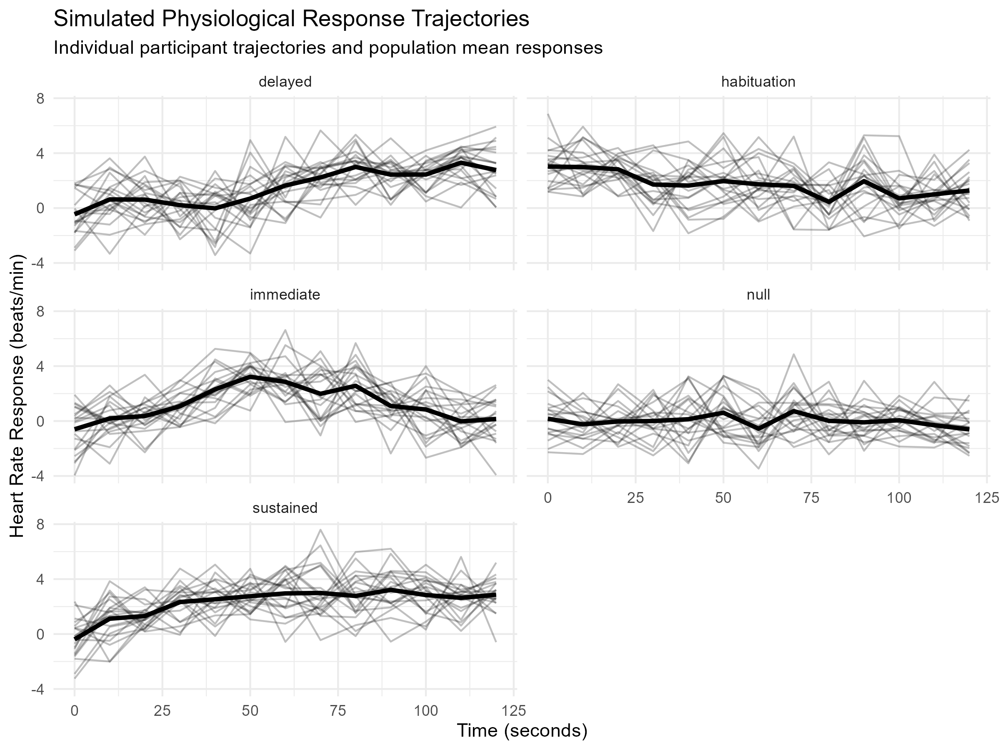
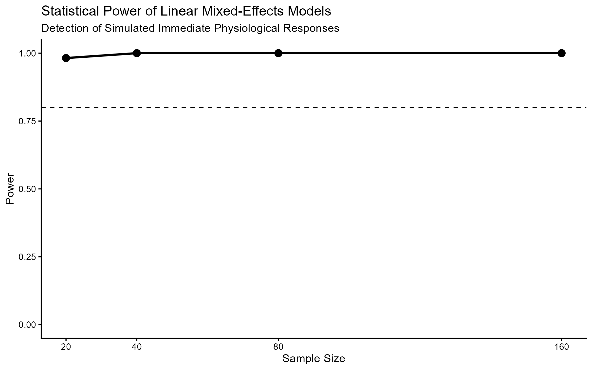

# physioSim

**physioSim** is an open-source R framework for simulating repeated-measures physiological time-series data and benchmarking statistical methods under controlled experimental conditions.

The framework was developed to investigate how characteristics of physiological signals—such as temporal autocorrelation, participant-level heterogeneity, measurement noise, and missing observations—influence statistical inference for repeated-measures analyses.

---

## Features

* Simulates physiologically plausible response trajectories
* Supports multiple temporal response patterns:

  * Null response
  * Immediate activation
  * Delayed activation
  * Habituation
  * Sustained activation
* Incorporates participant-specific random effects
* Models temporal dependence using AR(1) processes
* Simulates missing observations
* Provides benchmarking workflows for linear mixed-effects models and related statistical approaches

---

## Repository structure

```
physioSim/
├── R/                  # Core simulation functions
├── analysis/           # Reproducible analysis scripts
├── simulations/        # Simulation study workflows
├── figures/            # Figures used in the manuscript
├── man/                # Function documentation
├── tests/              # Package tests
├── DESCRIPTION
├── NAMESPACE
└── README.md
```

---

## Installation

Clone the repository:

```bash
git clone https://github.com/jen-h-lu/physioSim.git
cd physioSim
```

Install required R packages:

```r
install.packages(c("tidyverse", "lme4", "broom.mixed"))
```

---

## Quick start

Generate a simulated physiological dataset:

```r
source("R/simulate_dataset.R")

data <- simulate_dataset(
  n_subjects = 40,
  response = "immediate",
  amplitude = 3,
  rho = 0.6,
  seed = 123
)

head(data)
```

Fit a linear mixed-effects model:

```r
library(lme4)

model <- lmer(
  observed_hr ~ condition + time + (1 | subject),
  data = data
)

summary(model)
```

---

## Example output

### Simulated physiological trajectories



### Statistical power across sample sizes



### Type I error under increasing temporal autocorrelation


---

## Reproducing the manuscript analyses

The analyses used in the accompanying manuscript can be reproduced by running the scripts in the `analysis/` and `simulations/` directories. A typical workflow is:

```r
source("analysis/01_generate_dataset.R")
source("analysis/02_effect_size.R")
source("simulations/06_method_benchmark.R")
```

---

## Associated manuscript

This repository accompanies the manuscript:

> **Lu, J.** *physioSim: An Open Simulation Framework for Benchmarking Statistical Methods for Physiological Time-Series Data.*

---

## Citation

If you use **physioSim** in research or teaching, please cite the repository and associated manuscript. GitHub provides a formatted citation automatically through the **“Cite this repository”** feature.

---

## License

This project is released under the **MIT License**.

---

## Future directions

Planned extensions include:

* Additional physiological modalities (EDA, EEG, respiration)
* More complex missing-data mechanisms
* Alternative temporal dependence structures
* Generalized additive models and functional data analysis benchmarking
* Bayesian hierarchical modeling workflows

---

Developed by **Jenna Lu** at the **University of Florida**.
